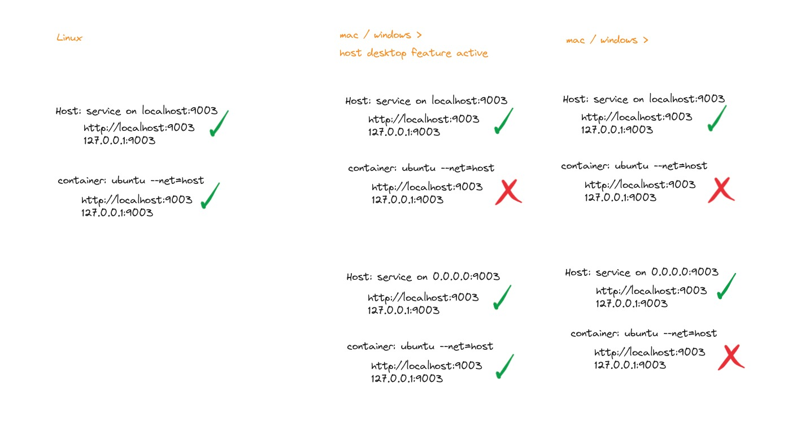

# BEWE Enviroment

## 1. Network configuration

```sh
docker network create bewe-network
```

To run appropriately all projects of bewe by docker configuration we need to warranty that they are on the same network, but first we need to take a considerations for understand why is the way.

on internet you can get example to use the `--network` or `--net`

```sh
docker run --it --net=host {{project-image}}
```

we want docker isolation for our projects, but this option expose your container on your net, and we need to keep in mind that only works if you are using docker engine from linux machine or using experimental option from docker desktop "host desktop feature", you need to consider use this because docker use networks for security purposes.



can you notice on the graphic that there are two test for docker desktop, runing project with localhost HOST and with 0.0.0.0 HOST.

> ### Understanding localhost` vs `0.0.0.0`
>
> When configuring a server or an application, you often need to specify an address to bind to. Two common options are `localhost` and `0.0.0.0`, and they serve different purposes:
>
> - **localhost (127.0.0.1)**: This address refers to the local computer only. When you bind your server to `localhost`, it will only accept connections that originate from the same machine. This is useful for development and testing purposes where you don't want your application to be accessible from other devices on the network.
>
>   **Example Use Case**: Running a development server on your personal computer that you do not want others on your network to access.
>
> - **0.0.0.0**: This address means "all available interfaces." When you bind your server to `0.0.0.0`, it will accept connections from any IP address assigned to the machine. This includes the local network and, if properly configured, external connections over the internet.
>
>   **Example Use Case**: Running a web server that needs to be accessible by other devices on your local network or over the internet.
>
> ### Summary
>
> - **`localhost`**:
>   - Binds to: Only the local machine.
>   - Accessibility: Local connections only.
>
> - **`0.0.0.0`**:
>   - Binds to: All network interfaces.
>   - Accessibility: Local and external connections.

or maybe you thought, i can only expose the needed port of the project like this.

```sh
docker run --it -p 9003:9003 {{project-image}}
```

on this case you can use the service from your host machine, but we can't forget the majority of services are communicating with each other like backend:9002 call stargate:3000, with this option.

## 2. Run core technologies

Init Bewe core, docker compose with this project.

```sh
cd {{docker-manager-folder}}/core/
docker compose up
```

> **Note**: require a existing network named bewe-network or edit the compose file for the name of the network that you wants

this repo is design to run the main infraestructure for all the projects on bewe, on `docker-compose.yml` can you find the next services:

- Redis
- Mongodb

Init Saas

```sh
cd {{docker-manager-folder}}/saas/
docker compose up
```

> **Note**: this compose file can exists or move to backend to execute

### 2.1 Mongodb population

The project has default subsets for generic purpose.

- Timkot
  - agency
  - agency configurations
- bewe account

for migration of your actually data follow the next steps:

- export your bh data base or all your data without `--db bh`

  ```sh
  mongodump --db bh --out ~/mongodb/backup
  ```

- copy your data to mongo container

  ```sh
  docker cp ~/mongodb/backup/ bewecore-mongodb-1:/data-backup/
  ```

- connect to your mongo container

  ```sh
  docker exec -it bewecore-mongodb-1 bash
  ```

- restore your data

  ```sh
  mongorestore --dir /data-backup
  ```

## 3) Run services

For this example we have a `docker-compose.yml` file for `stargate` service, it's only has and example, you can use the envs on .env file on the folder of the project

```yaml
services:
    stargate:
        build: ./
        ports:
            - ${NODE_PORT}:${NODE_PORT}
        volumes:
            - ./:/app
            - /app/node_modules
        restart: always
        environment:
            PORT: ${NODE_PORT}
            HOST: ${NODE_HOST}
    ##  extra_hosts:
    ##    - host.docker.internal:host-gateway
        networks:
          - bewe-network

networks:
  bewe-network:
    external: true

```

> **Note:** the only one service that need communication with a host project runing are the **backend**, thats because is the only who support the main behavior of the **frontend** , who cannot be migrated with good performance to docker enviroment.
>
>All others projects can communicate with each other by his name of service, thanks to the network in common
